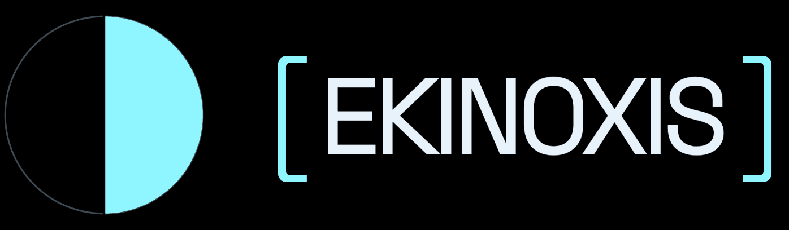

# [ EKINOXIS ] — Brand

The Ekinoxis brand system: logos, colors, typography, and the brand kit book.
Everything here is production-ready. SVGs are vector masters; PNGs are 2× rasters with the font baked in.



## The mark
A solid half-disc inside a circle, split by a vertical axis — the equinox: the moment light and dark are equal.

## Structure
```
brand/
├── README.md            you are here
├── colors.md            full palette + tokens
├── typography.md        faces, scale, embed link
├── logo/
│   ├── mark/            symbol only (no text)
│   ├── wordmark/        [ EKINOXIS ] text only (no symbol)
│   ├── horizontal/      mark + wordmark, primary lockup
│   └── stacked/         mark above wordmark (square formats)
│       └── each in svg/ and png/, in up to 5 colorways
├── favicon/             16 · 32 · 48 · 180 · 512 px
├── social/              1024×1024 avatars
├── brand-kit/           the brand book (HTML + PDF)
└── contact-cards/       print-ready cards
```

## Choosing a logo
| Situation | Use |
|---|---|
| Anything on dark / black | `*-cyan-on-black` or `*-cyan-transparent` |
| Light or clear backgrounds, docs | `*-cyan-on-light` |
| B&W print on dark | `*-white` |
| B&W print on light | `*-black` |
| Tight square spaces, avatars | `mark/` or `stacked/` |
| Text-only contexts (headers, footers) | `wordmark/` |

## Rules
- Clear space around the lockup: at least the height of one bracket
- Never recolor outside the 5 approved colorways
- Never distort, rotate, outline, or add drop shadows (ambient cyan glow is allowed on dark)
- The axis line always stays vertical
- Minimum sizes: mark 24px, horizontal lockup 120px wide

## Colors & type
See [colors.md](colors.md) and [typography.md](typography.md). Quick core:
`#8FF5FF` cyan · `#E8F2FB` ink · `#000000` black · `#9492FF` cosmic blue · `#CAFD00` neon lime

## Working in Figma
Drag any `.svg` onto the canvas. Install **Space Grotesk** first so lockup text renders; then `Cmd/Ctrl+Shift+O` to outline it if you need pure vectors.
